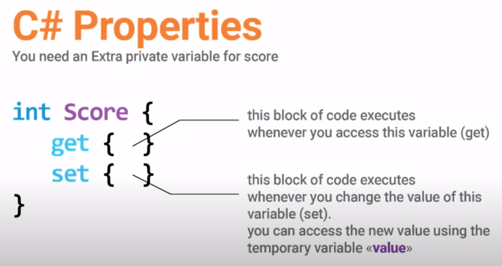

How to build an efficent UI with the right tools
===

## Unity Components

Unity has its components _**Layout Groups**_ and _**Layout Elements**_. Each element is in a hierarchy, where each behaviour are inherited from its parent. 

## Aspect Ration Fitter
Fit the rect tranform with the resolution of the screen, in this way the rect is resized ( Even outside the screen ) without scaling wrongly. Example at:

[](https://youtu.be/lhzB2qsoHpo?t=69)[https://youtu.be/lhzB2qsoHpo?t=69](https://youtu.be/lhzB2qsoHpo?t=69)

## Bind data to UI
Using the new C# properties you can bind variable modification with actions/functions.



Example code:

```csharp
public class ScoreManager : Monobehaviour {
	[SerializeField] TextScoreUI;
	
	private int _scr;

	public int Score {
		get { return _scr; }
		set { 
				// Update temporanly data
				_scr = value;
				
				// Update UI
				TextScoreUI.text = Score.ToString();
				
				// Update permanently data
				PlayerPrefs.SetInt("Score", Score);
		}
	}
}
```

Store settings using PlayerPrefs
================================

Player preferencesis and xml file where preferences, non-sensible data, are stored between game sessions. 

A good example of preferences are game settings.

```csharp
public static class GameData
{
	private static int _metals;
	private static int _coins;
	private static int _gems;

	static GameData()
	{
		_metals = PlayerPrefs.GetInt("Metals", 0); <-- 0 se non trova nulla
		_coins = PlayerPrefs.GetInt("Coins", 0);
		_gems = PlayerPrefs.GetInt("Gems", 0);
	}

	public static int Metals
	{
		get{ return _metals; }
		set{ PlayerPrefs.SetInt("Metals", (_metals = value) ); }
	}

	public static int Coins
	{
		get{ return _coins ; }
		set{ PlayerPrefs.SetInt("Coins", (_coins = value) ); }
	}

	public static int Gems
	{
		get{ return _gems ; }
		set{ PlayerPrefs.SetInt("Gems", (_gems = value) ); }
	}

}
```